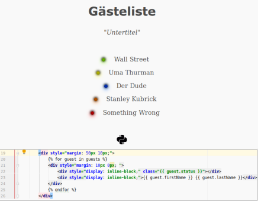

# guest list micro app for guestoo

*application template to create a (public) guest list page*

* * * 




### Getting started:

The app is ready to be deployed and needs only some environment variables.


If you would like to customize it to your reqs set up a development environment:

```
$ git clone git@github.com:erkandem/guestlist.git
$ virtualenv ./.venv -p python 3.7
$ . .venv/bin/activate
$ (.venv) pip install -r requirements.txt
```
and finally:
```
$ (.venv) gunicorn wsgi -b 127.0.0.1:5000
```
or:
```
$ (.venv) python app.py
```
or:
```
$ FLASK_APP=app.py
$ FLASK_ENV=development
$ flask run
```

### environment variables 

A template is available ``$ mv ./.env_template .env``

```
REFRESH_URI=
LOGIN_USER_NAME=
LOGIN_SECRET=
EVENT_ID=
```

#### `REFRESH_URI`
Set a URI to trigger a re-login and get a fresh oAuth token.
This is necessary because the initial token will expire
adjust the setting in ´config.py´
```
$ echo "REFRESH_URI=$(openssl rand -hex 32)" >> .env
```

#### `LOGIN_*`
> not your account-login !!!

To retrieve data via the guestoo API you have to create an `API-USER` first
 `https://app.guestoo.de/events/list` > `API` > `API-USER` > ` Neuer API-User`

Be sure to set required access right (`GAST-API`, `EVENT-API`) and
the authorization schema (`Type: OAUTH`)


#### `EVENT_ID`
and finally the event-id UUID
Something like: `f3786f78-f895-41e6-090c7-5a02518b661f`


### `Deployment`
 - via Container:
```
$ docker build -t guestlist:alpine  .
$ docker run -p 5000:5000 guestlist:alpine
```
 - via Heroku (Procfile added):
```
web: gunicorn wsgi
```
 - or of course on your own server/VPS (behind NGINX!):


### Used Resources
 - main style by sakura.css: https://github.com/oxalorg/sakura
 - status indicators:  https://github.com/aus/led.css
 - Python SVG icon: Icon made by https://www.flaticon.com/authors/freepik from www.flaticon.com

 - CSS normalize utility: https://github.com/necolas/normalize.css


#### Author 

 - Author: Erkan Demiralay
 - Contact: [erkan.dem@pm.me](mailto:erkan.dem@pm.me)
 - License:  [MIT](/LICENSE)


**Disclaimer:**

> Get the permission of your guests 
> to add them on a public guest list first!
> It' s your responsibility to collect their consent.

> I am not affiliated with guestoo. Names which may or may not be registered Trademarks 
> are used as a reference only. 
